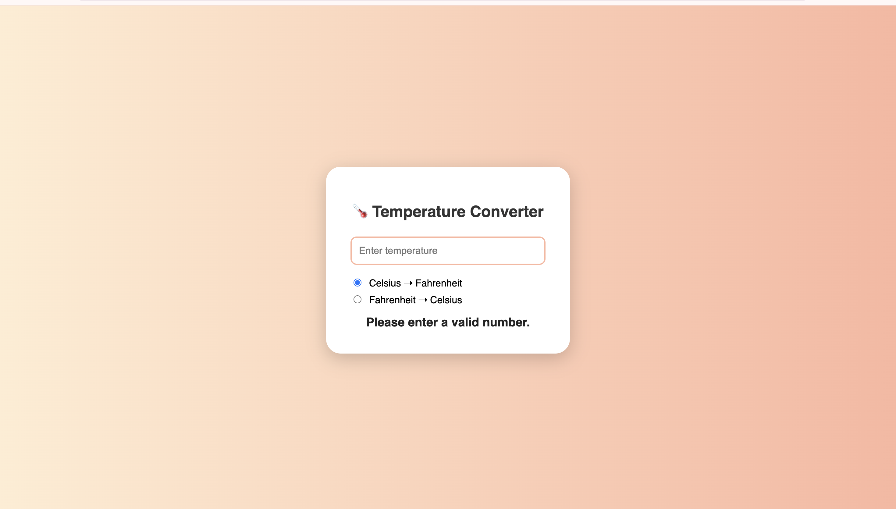

# Temperature Converter

A simple and user-friendly Temperature Converter built using HTML, CSS, and JavaScript. This application allows users to convert temperature values between Celsius (°C), Fahrenheit (°F), and Kelvin (K) instantly.

## Live Demo

Add your deployed Vercel link here:

```text
https://temperature-converter-sigma-seven.vercel.app/
```

## Features

- Convert Celsius to Fahrenheit and Kelvin
- Convert Fahrenheit to Celsius and Kelvin
- Convert Kelvin to Celsius and Fahrenheit
- Real-time conversion
- Responsive design
- Clean and intuitive user interface
- Input validation

## Technologies Used

- HTML5
- CSS3
- JavaScript (ES6)

## Preview



## 📂 Project Structure

```text
temperature-converter/
├── index.html
├── style.css
├── script.js
├── screenshots/
│   └── temperature-converter.png
└── README.md
```

## How It Works

1. Enter a temperature value.
2. Select the input temperature unit.
3. Click the convert button.
4. View the converted values in other temperature units instantly.

## Learning Outcomes

Through this project, I learned:

- JavaScript Event Handling
- DOM Manipulation
- Mathematical Conversions
- Form Validation
- Responsive Web Design

## Temperature Conversion Formula

### Celsius to Fahrenheit

```text
°F = (°C × 9/5) + 32
```

### Fahrenheit to Celsius

```text
°C = (°F − 32) × 5/9
```

### Celsius to Kelvin

```text
K = °C + 273.15
```
